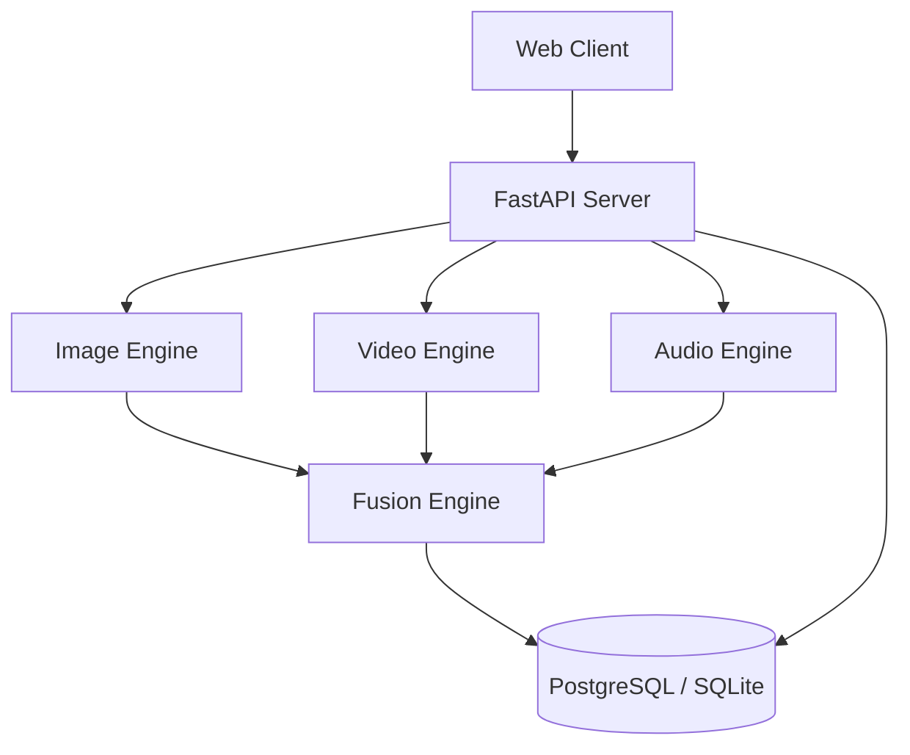

# DeepGuard Platform Architecture

The DeepGuard Platform is designed as a multimodal deepfake detection system consisting of four primary components: the Image Engine, Video Engine, Audio Engine, and the Fusion Engine.

## High-Level Diagram

## System Components

### 1. `apps/api` (FastAPI Backend)
Serves as the entry point for all client requests. Handles authentication (JWT), routing, rate-limiting, and background task queuing.

### 2. `engines/image-engine` (IDS)
Performs deepfake detection on static images. Utilizes spatial and frequency domain feature extraction, followed by an ensemble of models to determine authenticity. Generates GradCAM heatmaps for explainability.

### 3. `engines/video-engine` (VDS)
Processes video files by extracting frames and audio tracks. Performs temporal feature tracking and scene segmentation to detect anomalies across sequential frames.

### 4. `engines/audio-engine` (ADS)
Analyzes audio tracks using WavLM, XLS-R, and spectral CNN branches. Detects voice cloning and adversarial perturbations.

### 5. `engines/fusion-engine`
Combines the confidence scores and feature vectors from the individual modality engines using a cross-attention transformer to yield a final overarching `DeepfakeVerdict`.

## Lightweight Deployment Stack
To accommodate local 4GB RAM constraints, the architecture supports a lightweight stack:
- **Database**: SQLite (via `aiosqlite`) or Serverless Neon PostgreSQL instead of Dockerized local Postgres.
- **Task Queue**: Built-in FastAPI `BackgroundTasks` instead of Celery + Redis.
- **MLOps**: File-based MLflow (`file:./mlruns`) instead of a dedicated MLflow server.
